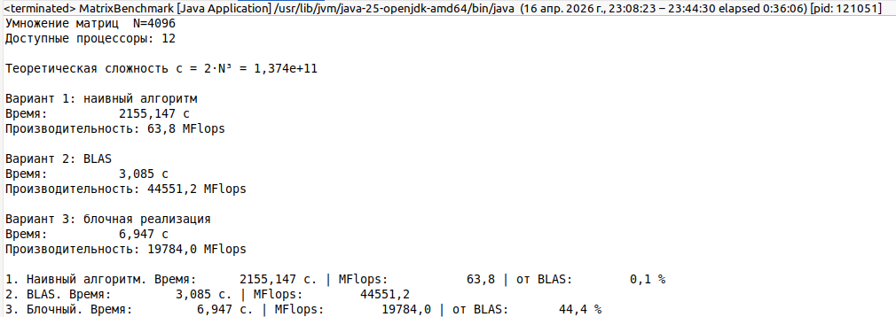

# Лабораторная работа №2, перемножение матриц

Задача: *перемножить 2 квадратные матрицы размера NxN (4096x4096) с элементами типа double.*

# Сложность

Для перемножения одной строки с одним столбцом мы сначала должны пройтись по каждому соотвествующему элементу и перемножить их ($N$), а потом выполнить операции сложения ($N-1$): это примерно $2N$.  
Всего таких элементов у нас $N^2$. 

Получаем $2N^3$ операций.

Теоретическая сложность c = $2N^3$ = 1,374e+11, то есть около 137 миллиардов операций.

## Наивный алгоритм

Начнём с самого очевидного и простого алгоритма: начнём перемножать строки на столбцы по очереди, как мы делали это в курсе математики. Для этого напишем три вложенных цикла:

```
Псевдокод:
for i
  for j
    for k
      C[i][j] += A[i][k] * B[k][j]
```
Сложность: O(n³)

В данной реализации используется один поток, из-за чего мы получаем слишком плохую производительность. На моём процессоре пересчёт занял 743 секунды. К тому же, мы проходимся по столбцам матрицы B, из-за чего кэш используется неэффективно. 

Вот как это выглядит в коде (в программе я решил использовать одномерные матрицы как двумерные, чтобы немного оптимизировать процесс):

```java
    static double[] multiplyNaive(double[] A, double[] B, int n) {
        double[] C = new double[n * n];
        for (int i = 0; i < n; i++) {
            for (int j = 0; j < n; j++) {
                double sum = 0.0;
                for (int k = 0; k < n; k++) {
                    sum += A[i * n + k] * B[k * n + j];
                }
                C[i * n + j] = sum;
            }
        }
        return C;
    }
```

## Функция cblas_dgemm

Библиотека JBLAS, являющаяся обёрткой над BLAS, содержит метод `a.mmul(b)`, который, в свою очередь, ссылается на нативный метод (то есть метод, вызывающий код на C/C++) `public static native void dgemm()` — он ссылается на cblas_dgemm.

Для реализации этого варианта достаточно вызвать этот метод. 

Реализация методов BLAS довольно тяжела и многолсовна для быстрого описания, но можно подытожить, что BLAS делит матрицы на блоки, а также использует многопоточность. 

На моём процессоре вычисление заняло 3 секунды, что несравнимо быстрее наивного алгоритма. 

## Собственная реализация

Разбирая наивный алгоритм отмечалось, что прохождение по столбцам вызывает проблемы с промахами кэша. Для оптимизации достаточно просто транспонировать матрицу. Тогда оба массива будут проходиться последовательно (без прыжков через 4096 чисел).

С помощью метода availableProcessors() получим количество процессоров компьютера и создадим пул рабочих потоков ForkJoinPool (из нативной библиотеки). 

Далее поделим матрицу A на горизонтальные полосы — блоки по 64 строк. Для матрицы 4096×4096 получается 4096/64 = 64 блока.

Далее мы указываем, что расчёты каждого блока должны производиться параллельно:

```java
pool.submit(
            () ->
                IntStream.range(0, (n + TILE - 1) / TILE)
                    .parallel()
                    .forEach(...)
                    ...)
```

Для блока `ti` вычисляем, с какой строки начинаем (`iStart`) и на какой заканчиваем (`iEnd`).  

```java
int iStart = ti * TILE; int iEnd = Math.min(iStart + TILE, n);
```
  
`Math.min(..., n)` нужен для последнего блока — если N не делится ровно на TILE, последний блок будет меньше. Однако в нашем примере значения поделятся поровну. 

Далее мы проходим по матрице Bт (т.е. по столбцам оригинальной B) тоже блоками по 64. Вместе с предыдущим шагом это значит: мы работаем с квадратным блоком 64×64 матрицы C за раз. Такой блок содержит 64×64×8 байт, что примерно 32 КБ — это помещается в L2-кэш процессора.

Далее снова ограничиваем блок с другой стороны на такое же значение (получаем квадратные матрицы). 

Оставшаяся часть алгоритма — умножение в пределах маленьких блоков. 

Данный алгоритм показал на моём процессоре результаты:

```
Время: 6,908 с. | MFlops: 19896,3 | от BLAS: 42,8 %
```

Что соответствует условию задачи

# Результат выполнения



# Листинг

MatrixBenchmark.java
```java
package com.github.fnvm.MatrixLab;

import org.jblas.DoubleMatrix;

import java.util.Random;
import java.util.concurrent.ForkJoinPool;
import java.util.stream.IntStream;

/*
 * Для пропуска наивного алгоритма запустить с аргументом -s
 * Иначе он будет считать вечно...
 */
public class MatrixBenchmark {

  private static final int N = 4096;
  private static final double complexity = 2.0 * Math.pow(N, 3);
  // Для собственной реализации:
  private static final int TILE = 64;
  private static final int PARALLELISM = Runtime.getRuntime().availableProcessors();

  public static void main(String[] args) {
    boolean skip = false;
    if (args.length > 0 && args[0].trim().equals("-s")) {
      skip = true;
    }

    System.out.printf("=== Matrix Multiply Benchmark  N=%d ===%n", N);
    System.out.printf("Доступные процессоры: %d%n%n", PARALLELISM);

    System.out.printf("Теоретическая сложность c = 2·N³ = %.3e FLop%n%n", complexity);

    // Создание матриц
    double[] A = generateRandom(N);
    double[] B = generateRandom(N);

    double[] res = new double[2];
    if (!skip) {
      // Вариант 1
      System.out.println("Вариант 1: наивный алгоритм");

      long t1Start = System.nanoTime();
      double[] C1 = multiplyNaive(A, B, N);
      long t1 = System.nanoTime() - t1Start;

      res = getResult(t1, true);
    }

    // Вариант 2
    System.out.println("Вариант 2: BLAS");
    // JBLAS хранит данные по столбцам (Fortran-order), поэтому транспонируем
    DoubleMatrix mA = new DoubleMatrix(N, N, A).transpose();
    DoubleMatrix mB = new DoubleMatrix(N, N, B).transpose();

    long t2Start = System.nanoTime();
    DoubleMatrix mC = mA.mmul(mB);
    long t2 = System.nanoTime() - t2Start;

    double res2[] = getResult(t2, true);
    double sec2 = res2[0];
    double mflops2 = res2[1];

    // Вариант 3
    System.out.println("Вариант 3: блочная реализация");

    long t3Start = System.nanoTime();
    double[] C3 = multiplyTiledParallel(A, B, N);
    long t3 = System.nanoTime() - t3Start;

    double[] res3 = getResult(t3, true);
    double sec3 = res3[0];
    double mflops3 = res3[1];

    if (!skip) {
      double sec1 = res[0];
      double mflops1 = res[1];

      System.out.printf(
          "1. Наивный алгоритм. Время: %13.3f с. | MFlops: %14.1f | от BLAS: %10.1f %%%n",
          sec1, mflops1, mflops1 / mflops2 * 100);
    }
    System.out.printf("2. BLAS. Время: %13.3f с. | MFlops: %14.1f %n", sec2, mflops2);
    System.out.printf(
        "3. Блочный. Время: %13.3f с. | MFlops: %14.1f | от BLAS: %10.1f %%%n",
        sec3, mflops3, mflops3 / mflops2 * 100);
  }

  // Наивный алгоритм перемножения матриц
  public static double[] multiplyNaive(double[] A, double[] B, int n) {
    double[] C = new double[n * n];
    for (int i = 0; i < n; i++) {
      for (int j = 0; j < n; j++) {
        double sum = 0.0;
        for (int k = 0; k < n; k++) {
          sum += A[i * n + k] * B[k * n + j];
        }
        C[i * n + j] = sum;
      }
    }
    return C;
  }

  // Вариант 3
  public static double[] multiplyTiledParallel(double[] A, double[] B, int n) {
    double[] Bt = transpose(B, n);
    double[] C = new double[n * n];

    // Делим строки матрицы A между потоками
    ForkJoinPool pool = new ForkJoinPool(PARALLELISM);

    pool.submit(
            () ->
                IntStream.range(0, (n + TILE - 1) / TILE)
                    .parallel()
                    .forEach(
                        ti -> {
                          int iStart = ti * TILE;
                          int iEnd = Math.min(iStart + TILE, n);

                          for (int tj = 0; tj < n; tj += TILE) {
                            int jEnd = Math.min(tj + TILE, n);

                            for (int tk = 0; tk < n; tk += TILE) {
                              int kEnd = Math.min(tk + TILE, n);

                              for (int i = iStart; i < iEnd; i++) {
                                int rowA = i * n + tk;
                                for (int j = tj; j < jEnd; j++) {
                                  int rowBt = j * n + tk;
                                  double sum = C[i * n + j];
                                  for (int k = 0; k < kEnd - tk; k++) {
                                    sum += A[rowA + k] * Bt[rowBt + k];
                                  }
                                  C[i * n + j] = sum;
                                }
                              }
                            }
                          }
                        }))
        .join();

    pool.shutdown();
    pool.close();
    return C;
  }

  // Генерация случайной матрицы n×n
  public static double[] generateRandom(int n) {
    Random rnd = new Random(42L);
    double[] M = new double[n * n];
    for (int i = 0; i < M.length; i++) {
      M[i] = rnd.nextDouble() * 2.0 - 1.0; // [-1, 1)
    }
    return M;
  }

  // Транспонирование матрицы n×n
  public static double[] transpose(double[] M, int n) {
    double[] T = new double[n * n];
    for (int i = 0; i < n; i++) {
      for (int j = 0; j < n; j++) {
        T[j * n + i] = M[i * n + j];
      }
    }
    return T;
  }

  private static double[] getResult(long nanoseconds, boolean print) {
    double sec = nanoseconds * 1e-9;
    double mflops = complexity / sec * 1e-6;

    if (print) {
      System.out.printf("Время:          %.3f с%n", sec);
      System.out.printf("Производительность: %.1f MFlops%n%n", mflops);
    }

    return new double[] {sec, mflops};
  }
}

```

pom.xml

```xml
<?xml version="1.0" encoding="UTF-8"?>
<project xmlns="http://maven.apache.org/POM/4.0.0" xmlns:xsi="http://www.w3.org/2001/XMLSchema-instance"
  xsi:schemaLocation="http://maven.apache.org/POM/4.0.0 http://maven.apache.org/xsd/maven-4.0.0.xsd">
  <modelVersion>4.0.0</modelVersion>

  <groupId>com.github.fnvm</groupId>
  <artifactId>MatrixLab</artifactId>
  <version>0.0.1</version>

  <name>MatrixLab</name>
  <url>http://www.example.com</url>

  <properties>
    <project.build.sourceEncoding>UTF-8</project.build.sourceEncoding>
    <maven.compiler.release>25</maven.compiler.release>
  </properties>

    <dependencies>
        <dependency>
            <groupId>org.jblas</groupId>
            <artifactId>jblas</artifactId>
            <version>1.2.5</version>
        </dependency>
    </dependencies>
 

</project>
```


# Сборка

Для теста наивного алгоритма убрать `-Dexec.args="-s"` (может считать >30мин)

```bash
git clone 
mvn clean compile
mvn exec:java -Dexec.args="-s"
```